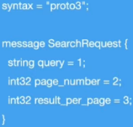

# gRPC

### O que é gRPC

* **gRPC**: (R)emote (P)rocedure (C)all

* É uma framework desenvolvido pela Google que tem o objetivo de facilitar o processo de comunicação entre sistemas de uma forma extremamente rápida, leve, independente de linguagem

* Faz parte da CNCF (Cloud Native Computing Foundation)

### Quando utilizar?

* Microsserviços (principalmente)

* Back-end

* Mobile

* Browsers (em andamento)

### Protocol Buffers

* **Definição**

    * Linguagem neutra do Google
    
    * Mecanismo extensivo para serialização de estrutura de dados

    * Mas rápido, inteligente e simplificado do que o XML/JSON

* **Protocol Buffers vs JSON**

  * Arquivos binários < JSON (plain text)

  * Processo de serialização é mais leve (CPU) do que JSON

  * Gasta menos recursos de rede

  * Processo mais veloz

* **Estrutura**

  

  > 1, 2, 3 são Tags do Protocol Buffers

* **Exemplo**

  ```protobuf
  syntax = "proto3";
  package payment;
  option go_package = "grpc/pb"; // go_packege é específico para o Go | "pb" = Protocol Buffer

  import "google/protobuf/empty.proto";

  service PaymentService {
    rpc Payment(PaymentRequest) returns (google.protobuf.Empty) {}
  }

  message PaymentRequest {
    CreditCard creditCard = 1;
    double amount = 2;
    string store = 3;
    string description = 4;
  }

  message CreditCard {
    string name = 1;
    string number = 2;
    int32 expirationMonth = 3;
    int32 expirationYear = 4;
    int32 cvv = 5;
  }
  ```

  **OU**

  ```protobuf
  syntax = "proto3";
  package payment;
  option go_package = "grpc/pb";

  import "google/protobuf/empty.proto";

  service PaymentService {
    rpc Payment(PaymentRequest) returns (google.protobuf.Empty) {}
  }

  message PaymentRequest {

    message CreditCard {
      string name = 1;
      string number = 2;
      int32 expirationMonth = 3;
      int32 expirationYear = 4;
      int32 cvv = 5;
    }

    CreditCard creditCard = 1;
    double amount = 2;
    string store = 3;
    string description = 4;
  }
  ```

### HTTP/2

* Nome original cirado pela Google era SPDY

* Lancado em 2015

* Dados trafegados são binários e não texto como no HTTP 1.1

* Utiliza a mesma conexão TCP para enviar e receber dados do cliente e do servidor (Multiplex)

* _Server Push_

* _Headers_ são comprimidos

* Gasta menos recurso de rede

* Processo é mais veloz

### Tipos de gRPC

* **gRPC - API "unary"**

  

* **gRPC - API "Server streaming"**

  

* **gRPC - API "Client streaming"**

  

* **gRPC - API "Bi directional streaming"**

  

### REST vs gRPC

  * **REST**

    * Texto / JSON

    * Unidirecional

    * Alta latência

    * Sem contrato (maior chance de erros)

    * Sem suporte a streaming (Request / Response)

    * Design pré-definido (REST foca nas operações HTTP (GET, PUT, POST, DELETE, etc) -> CRUD)

    * Uso de muitas biblioteca de terceiros

  * **gRPC**

    * Protocol Buffers

    * Bidirecional e assíncrono

    * Baixa latência

    * Contrato definido pelo `.proto`

    * Suporte a streaming

    * Design é livre

    * Sem dificuldades de implementação de bibliotecas de terceiros (**geração de códigos com stubs**)

### Geração dos stubs e protobuf com Makefile

* **Arquivo Makefile**

  ```makefile
  gen:
    protoc --proto_path=infrastructure/grpc infrastructure/grpc/protofile/*.proto --go_out=infrastructure/ --go-grpc_out=infrastructure/
  ```

* **Comando**: `$ make gen`