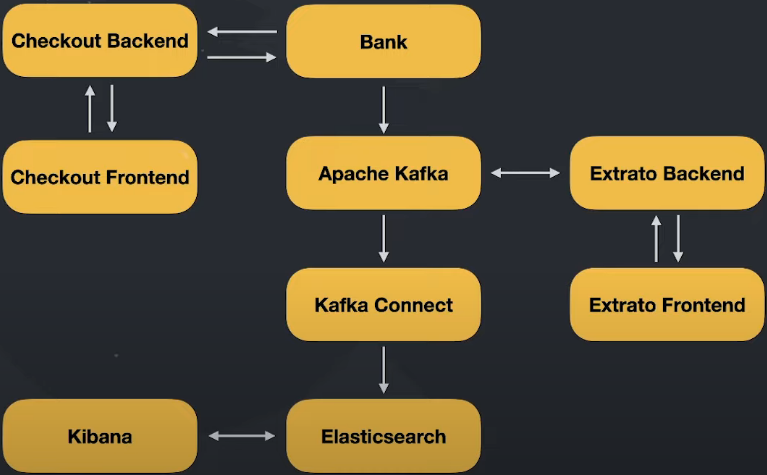

# Code Bank

### O que iremos desenvolver?

* Desenvolveremos um banco digital que disponibiliza cartões de crédito para seus clientes

* O cliente realizará o _checkout_ de um produto

* O "Banco" processará a transação

* Caso a transação seja aprovada, ela constará no extrato bancário do cliente

* Teremos um dashboard para acompanhar as métricas da transações

### Pontos importantes

* Tudo é uma **simulação** para que possamos fazer microsserviços se comunicarem

* **Não há validação** alguma de segurança

* Faremos com que os sistemas consigam conversar de forma síncrona e assíncrona para que possamos
  explorar conceitos e tecnologias utilizadas em grandes empresas que necessitam de performance e resiliência

* Temos apenas 7 dias

### Alguns desafios

* **Problema**: Precisaremos de altíssima performance na comunicação entre o sistema de _checkout_ e o banco, logo, precisamos de uma solução mais veloz que o **Rest**

* **Solução**: Trabalharemos com gRPC, um framework criado pela Google que permite realizarmos as transações de forma rápida transitando o _payload_ em binários usando o protocolo HTTP2

* **Problema**: Precisamos garantir resiliência entre a sincronização do processamento das transações com o serviço de extrato bancário

* **Solução**: Trabalharemos com esse processamento de forma assíncrona e para isso utilizaremos o poderoso Apache Kafka

* **Problemas**: Utilizaremos o _Elasticsearch_ e Kibana para gerarmos o _dashboard_ de métricas das transações, porém não é responsabilidade do microsserviço do banco persistir os dados no _Elasticsearch_. Logo, como armazenar as informações no _Elasticsearch_

* **Solução**: Utilizaremos o Kafka Connect que também consumirá os dados de cada transação e fará a inserção no _Elasticsearch_

### Dinâmica do sistema

### Tecnologias a serem utilizadas

* Bank: Golang

* Checkout e Extrato Backend: Nest.js

* Checkout e Extrato Frontend: Next.js

* Kafka e Kafka Connect

* Elasticsearch e Kibana

* Docker e Kubernetes

* Istio, Kiali, Prometheus e Grafana